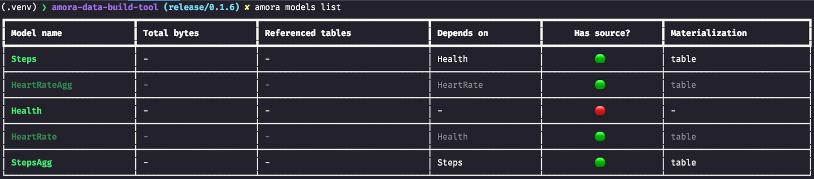
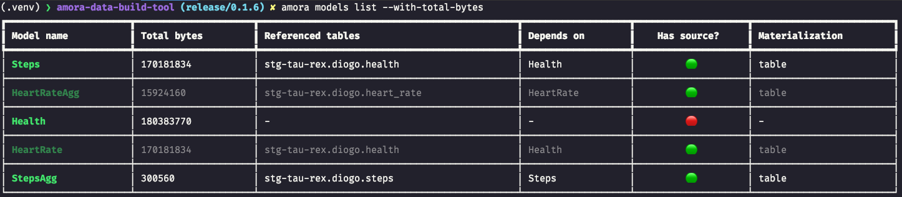

# CLI

Amora comes packed with a Command Line Interface, developed using [tiangolo/typer](http://typer.tiangolo.com). 
To check all the options, type `amora --help` after the installation.

```
Usage: amora [OPTIONS] COMMAND [ARGS]...

  Amora Data Build Tool enables engineers to transform data in their
  warehouses by defining schemas and writing select statements with
  SQLAlchemy. Amora handles turning these select statements into tables and
  views

Options:
  --install-completion  Install completion for the current shell.
  --show-completion     Show completion for the current shell, to copy it or
                        customize the installation.
  --help                Show this message and exit.

Commands:
  compile      Generates executable SQL from model files.
  materialize  Executes the compiled SQL against the current target...
  models
  test         Runs tests on data in deployed models.


```

## amora compile

::: amora.cli.compile

## amora materialize

::: amora.cli.materialize

## amora test

::: amora.cli.test

## amora models

### amora models list

::: amora.cli.models_list



---



---
If a machine readable format is required, the `--format json` option can be used as followed:

```shell
$ amora models list --format json
```

```json
{
  "models": [
    {
      "depends_on": [
        "Health"
      ],
      "has_source": true,
      "materialization_type": "table",
      "model_name": "Steps",
      "referenced_tables": [],
      "total_bytes": null
    },
    {
      "depends_on": [
        "HeartRate"
      ],
      "has_source": true,
      "materialization_type": "table",
      "model_name": "HeartRateAgg",
      "referenced_tables": [],
      "total_bytes": null
    },
    {
      "depends_on": [],
      "has_source": false,
      "materialization_type": null,
      "model_name": "Health",
      "referenced_tables": [],
      "total_bytes": null
    },
    {
      "depends_on": [
        "Health"
      ],
      "has_source": true,
      "materialization_type": "table",
      "model_name": "HeartRate",
      "referenced_tables": [],
      "total_bytes": null
    },
    {
      "depends_on": [
        "Steps"
      ],
      "has_source": true,
      "materialization_type": "table",
      "model_name": "StepsAgg",
      "referenced_tables": [],
      "total_bytes": null
    }
  ]
}

```

### amora models import
::: amora.cli.models_import

## amora feature-store 

!!! info
    Requires the `feature-store` package extra

### amora feature-store plan
::: amora.cli.feature_store_plan

### amora feature-store apply
::: amora.cli.feature_store_apply

### amora feature-store materialize
::: amora.cli.feature_store_materialize

### amora feature-store serve
::: amora.cli.feature_store_serve
